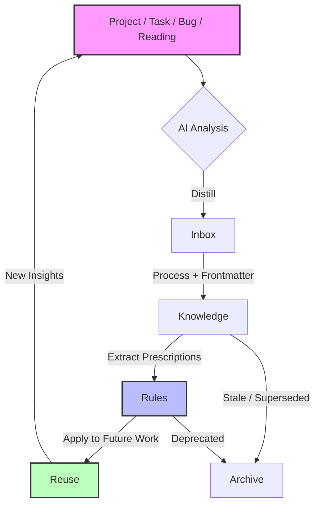

# Personal Engineering Operating System

> A living, AI-first knowledge system for software engineers. Not a notes repository. Not a wiki. An operating system for your technical mind.

---

## Quick Start

1.  **Clone / initialize** this repo as your private `engineering-os`.
2.  **Set up your AI agent** (Claude Code, Codex, etc.) to read this README on every session start.
3.  **Drop everything into `inbox/` first.** Do not file directly into `knowledge/`.
4.  **Process inbox daily.** Convert raw inputs into structured Markdown with frontmatter.
5.  **Apply rules immediately.** When you learn a lesson, write it as a rule in `rules/`.
6.  **Review weekly.** Archive stale items. Verify what matters.

---

## 1. Project Vision

This repository exists to solve a single problem: **the waste of engineering knowledge.** Every bug you fix, every API you wrestle with, every architecture you debate, every lesson you learn, it all evaporates. You re-learn it six months later. Your AI assistants start from zero every session. Your career progresses, but your personal knowledge base does not compound.

This is an **Engineering Operating System**, not a notes repository. The difference is structural and philosophical:

| Notes Repository | Engineering OS |
| :--- | :--- |
| Passive storage | Active processing pipeline |
| Human-only consumption | Human + AI co-authorship |
| Accumulates | Evolves and archives |
| Documents what happened | Shapes what happens next |

The lifecycle is a closed loop:

```
Input → Process → Store → Reuse → Evolve
```

*   **Input:** Raw material. A bug report. A blog post. A code snippet. A conversation with a colleague. A shower thought.
*   **Process:** Distillation. What is the core insight? What is the actionable rule? What is the reusable pattern? The AI agent assists here.
*   **Store:** Structured, standardized Markdown with strict frontmatter, tags, and status. Stored in the correct directory based on its nature and maturity.
*   **Reuse:** Retrieval. The AI agent reads the relevant rules before starting a task. You grep for `#docker` when a container fails. The knowledge is *applied*, not merely *read*.
*   **Evolve:** Nothing is static. Rules are updated when tools change. Knowledge is verified or deprecated. The system learns as you learn.

---

## 2. Repository Structure

```
my-engineering-os/
├── README.md          # This file. The constitution.
├── CLAUDE.md          # Agent context and rules of engagement
├── inbox/             # Raw, unprocessed inputs. The catch-all.
├── knowledge/         # Mature, structured, verified technical knowledge
├── rules/             # Actionable, prescriptive engineering rules
├── playbooks/         # Step-by-step runbooks and procedures
├── projects/          # Active and archived project-specific work
├── templates/         # Markdown templates for new entries
├── index/             # Navigation: topics, tags, roadmap
├── automation/        # Scripts, hooks, and future automation
└── meta/              # OS changelog, proposals, and health reports
```

### `inbox/` — The Intake

*   **What goes in:** Everything. Screenshots, quick `.md` files, copy-pasted error logs, URLs, voice memos transcriptions, raw meeting notes.
*   **What does NOT go in:** Nothing. This is the only place where chaos is allowed.
*   **Lifecycle:** Items must be processed within 24-48 hours. They move to `knowledge/`, `rules/`, `playbooks/`, `projects/`, or `projects/archived/`.
*   **Example:** `inbox/2026-06-19-docker-build-failure.log` — a raw log dump from a failed CI build.

### `knowledge/` — The Core

*   **What goes in:** Distilled technical understanding. "How X works," "Comparison of Y and Z," "Deep dive into W." Each file is a standalone, reusable article.
*   **What does NOT go in:** Raw logs, transient project notes, one-off bug fixes, opinions without evidence, unverified claims.
*   **Lifecycle:** `Inbox` → `Draft` → `Verified` → `Archived`. Verified knowledge is the single source of truth.
*   **Example:** `knowledge/docker/dockerfile-layer-caching.md` — a structured guide on Dockerfile optimization with benchmarks.

### `rules/` — The Prescriptions

*   **What goes in:** "Always do X," "Never do Y," "When Z happens, run W." These are commands, not descriptions. They are written to be read by AI agents before tasks.
*   **What does NOT go in:** Explanations of *why* (those go in `knowledge/`). Long-form tutorials. Suggestions or "maybes."
*   **Lifecycle:** Rules are updated in place. When a rule is superseded, it is moved to `projects/archived/` or marked `Status: Archived`.
*   **Example:** `rules/coding/python/always-use-ruff-instead-of-flake8.md` — a one-line command and a brief justification.

### `playbooks/` — The Runbooks

*   **What goes in:** Step-by-step procedures: how to debug X, how to deploy Y, how to run a root-cause analysis, how to kick off a project.
*   **What does NOT go in:** Long-form explanations (those go in `knowledge/`), generic rules (those go in `rules/`), raw logs.
*   **Lifecycle:** Updated after every real execution. A playbook that has not been run in 6 months becomes a candidate for review.
*   **Example:** `playbooks/debugging/debug-docker-network.md`

### `projects/` — The Workspace

*   **What goes in:** Active project context, architecture decision records (ADRs), retrospectives, research spikes, and temporary notes.
*   **What does NOT go in:** Permanent knowledge (move to `knowledge/` when the project ends). Raw logs (keep in `inbox/` or project-specific `tmp/` subdirs).
*   **Lifecycle:** Active → Maintenance → Archived (`projects/archived/`). When a project is done, its reusable knowledge is extracted to `knowledge/` and `rules/`.
*   **Example:** `projects/2026-api-gateway-refactor/adr-003-choosing-kong.md`

### `templates/` — The Scaffolding

*   **What goes in:** Markdown templates for new `knowledge/`, `rules/`, `playbooks/`, and `projects/` entries.
*   **What does NOT go in:** Data. These are blank forms.
*   **Example:** `templates/knowledge.md` — a file with all required frontmatter fields pre-filled.

### `index/` — The Map

*   **What goes in:** Canonical navigation files: `topics.md`, `tags.md`, `roadmap.md`.
*   **What does NOT go in:** Domain knowledge.
*   **Lifecycle:** Updated whenever a new tag is added or the roadmap changes.
*   **Example:** `index/topics.md` links every domain to its directories.

### `automation/` — The Engine

*   **What goes in:** Python/Bash scripts, GitHub Actions workflows, pre-commit hooks, and future agent bots that maintain the OS.
*   **What does NOT go in:** Application code. One-off manual commands. Project-specific deployment scripts (use `playbooks/deployment/`).
*   **Lifecycle:** Starts as a plan/README; evolves into scripts as needs repeat.
*   **Example:** `automation/sync-index.py` — regenerates `index/topics.md` from file tags.

### `meta/` — The OS Itself

*   **What goes in:** Changelog, structural proposals, usage statistics, health checks, and review reports about the Engineering OS.
*   **What does NOT go in:** Domain knowledge or operational runbooks.
*   **Lifecycle:** Append-only log of system changes.
*   **Example:** `meta/changelog-2026-06.md`

---

## 3. Knowledge Flow

The following Mermaid flowchart illustrates how information moves through the system, with AI as a co-processor at every stage.



*   **Project / Task / Bug / Reading:** The raw stimulus. A Jira ticket, a Hacker News thread, a production incident.
*   **AI Analysis:** The AI agent (Claude, Codex, etc.) reads the raw input alongside your existing rules and knowledge. It suggests categorization, extracts action items, and drafts initial Markdown.
*   **Inbox:** The holding area. The AI places drafts here for human review.
*   **Knowledge:** The human verifies the AI's draft, corrects hallucinations, and commits the structured file.
*   **Rules:** From verified knowledge, you extract hard rules. "Because I learned X, I will always do Y."
*   **Reuse:** On the next task, the AI reads the rules first. It does not start from zero. It starts from your accumulated wisdom.
*   **Archive:** What is no longer true is moved out of the active loop to prevent pollution.

---

## 4. Best Practices

This section provides concrete, step-by-step workflows for common engineering scenarios.

### (a) Discovering a Bug

1.  **Capture:** Immediately save the error log, stack trace, and reproduction steps to `inbox/bug-<date>-<brief-desc>.md`.
2.  **Analyze:** Ask your AI agent: "Analyze this bug in the context of my existing rules. Is this a known pattern?"
3.  **Fix:** Fix the bug in the codebase.
4.  **Distill:** Write a `knowledge/` entry: *What was the root cause?* Write a `rules/` entry: *How do I prevent this class of bug in the future?*
5.  **Link:** In the project tracker, link to the `knowledge/` and `rules/` files, not just the PR.

### (b) Reading Source Code

1.  **Context:** Before reading, ask the AI: "Summarize my existing knowledge about [Project X] and list relevant rules."
2.  **Annotate:** As you read, drop questions and observations into `inbox/`.
3.  **Map:** Use the AI to generate a Mermaid diagram of the architecture. Save it in `knowledge/<project>/architecture.md`.
4.  **Rule:** If you find a non-obvious pattern (e.g., "always use this mutex before accessing that cache"), write a `rules/` entry.

### (c) Learning a New Technology

1.  **Spike:** Create `projects/learn-<tech>-<date>/`.
2.  **Document:** For every tutorial or doc page you read, write a one-paragraph summary in `inbox/`.
3.  **Synthesize:** After 3-5 summaries, ask the AI to synthesize them into a single `knowledge/<tech>/getting-started.md` file.
4.  **Rule:** Once you have built something real, write `rules/<tech>/do-and-dont.md`.

### (d) Project Retrospective

1.  **Gather:** Collect all `inbox/` items, ADRs, and meeting notes from the project.
2.  **Analyze:** Ask the AI: "What patterns emerge? What went wrong? What rules were violated or missing?"
3.  **Output:** Write `projects/<name>/retrospective.md`. Extract 3-5 new `rules/` entries. Move reusable `knowledge/` to the global pool.
4.  **Archive:** Move the project directory to `projects/archived/` if it is fully complete.

### (e) Establishing Personal Engineering Rules

1.  **Trigger:** You encounter a friction point, a bug, or a decision you regret.
2.  **Draft:** Write a one-sentence imperative in `inbox/rules-ideas.md`. (e.g., "Always pin Docker base image digests.")
3.  **Justify:** Write a 3-sentence justification referencing the incident or knowledge that prompted it.
4.  **Formalize:** Move to `rules/<domain>/<rule-name>.md` with full frontmatter.
5.  **Enforce:** Add the rule to your AI agent's system prompt or `CLAUDE.md` so it is enforced on future tasks.

---

## 5. AI Agent Workflow

Your AI agents are not just chatbots; they are the primary consumers and co-authors of this knowledge base. Configure them to read this system before every task.

### Claude Code (Anthropic)

*   **Suitable Tasks:** Deep code analysis, refactoring, writing `knowledge/` and `rules/` drafts, complex debugging, architectural review.
*   **Integration:** Use the `CLAUDE.md` file in this repo to provide persistent context. Claude Code reads this automatically.
*   **Prompt Example:**
    > "I am about to refactor the authentication module. Before you start, read `rules/security/` and `knowledge/auth/`. Propose a plan that adheres to my existing rules. If you see a conflict between the code and a rule, flag it immediately."

### Codex (OpenAI)

*   **Suitable Tasks:** Rapid prototyping, generating boilerplate, writing tests, small-scale feature implementation, translating between languages.
*   **Integration:** Provide a system prompt that includes the path to your `rules/` directory. Use the API to include relevant rules as context.
*   **Prompt Example:**
    > "Generate a Python FastAPI endpoint for user registration. Adhere to the rules in `rules/python/api-design.md` and `rules/security/input-validation.md`. Return the code and a brief note on which rules you applied."

### ChatGPT / Web UI

*   **Suitable Tasks:** High-level research, brainstorming, summarizing long documents, learning new concepts, drafting initial structures.
*   **Integration:** Paste relevant `knowledge/` entries into the chat context. Use Custom Instructions to point to your GitHub repo if public.
*   **Prompt Example:**
    > "Here is my current knowledge on Docker layer caching: [paste `knowledge/docker/dockerfile-layer-caching.md`]. I am now reading a new article that contradicts point 3. Help me reconcile the two and update the knowledge entry."

### Generic Future Agents

*   **Suitable Tasks:** Any task where an AI needs to understand your preferences, past decisions, and technical standards.
*   **Integration:** Expose your `rules/` and `knowledge/` as a Retrieval-Augmented Generation (RAG) source. Ensure agents can query by tag and status.
*   **Prompt Example:**
    > "You are an agent operating within my Personal Engineering OS. Your context is: [RAG query: `status:Verified tag:infra`]. Your task is to review the following Terraform plan. Flag any violations of my infrastructure rules."

---

## 6. Knowledge Standards

All Markdown files in `knowledge/`, `rules/`, and `projects/` must adhere to these standards. Consistency enables AI parsing and human readability.

### Required Frontmatter

Every file must begin with YAML frontmatter:

```yaml
---
Title: "Human-readable, descriptive title"
Date: 2026-06-19
Tags: ["#tag1", "#tag2"]
Status: "Verified"  # See status values below
Source: "URL, book, conversation, or 'personal-experience'"
Related: ["knowledge/path/to/file.md", "rules/path/to/file.md"]
---
```

### Status Values

| Status | Meaning | Allowed Location |
| :--- | :--- | :--- |
| `Inbox` | Raw, unprocessed, potentially inaccurate. | `inbox/` only |
| `Draft` | Structurally complete, but not yet verified. | `knowledge/`, `rules/` (during review) |
| `Verified` | Human-reviewed, tested, and trusted. | `knowledge/`, `rules/` |
| `Archived` | Superseded or no longer relevant. | `projects/archived/` or `Status: Archived` |

### Formatting Rules

1.  **Headers:** Use `Title Case` for H1, `Sentence case` for H2 and below.
2.  **Links:** Use absolute paths within the repo for internal links (e.g., `[See here](/knowledge/docker/networking.md)`).
3.  **Code:** All code blocks must have a language tag. Keep snippets short; link to full files in projects if needed.
4.  **Tables:** Use tables for comparisons and structured data.
5.  **Mermaid:** Use Mermaid diagrams for flows, architectures, and state machines.
6.  **No PDFs/Word Docs:** Everything must be Markdown. Convert images to text descriptions or store them in `projects/<name>/assets/` and link them.

---

## 7. Tag System

Tags are the primary retrieval mechanism. They must be consistent, predictable, and extensible.

### Unified Tag Set

The following tags are predefined. Use them exactly as written (including the `#` prefix in frontmatter lists).

| Tag | Domain | Example Usage |
| :--- | :--- | :--- |
| `#bug` | Incident | Root cause analyses, post-mortems |
| `#infra` | Infrastructure | Docker, K8s, Terraform, CI/CD |
| `#docker` | Sub-infra | Dockerfile, compose, registries |
| `#architecture` | Design | ADRs, system design, patterns |
| `#ai` | AI/ML | Prompt engineering, model usage, agents |
| `#security` | Security | Auth, encryption, vulnerabilities |
| `#performance` | Performance | Benchmarks, optimization, profiling |
| `#python` | Language | Python-specific knowledge/rules |
| `#typescript` | Language | TS/JS-specific knowledge/rules |
| `#database` | Data | SQL, NoSQL, schema design |
| `#frontend` | Frontend | React, CSS, browser behavior |
| `#backend` | Backend | API design, server logic |
| `#testing` | Quality | Unit tests, integration, TDD |
| `#career` | Growth | Retrospectives, learning plans, soft skills |
| `#meta` | System | About this OS itself (e.g., this README) |

### Rules for Adding New Tags

1.  **Necessity:** Do not add a tag for a one-off item. If a topic has fewer than 3 entries, use a broader parent tag (e.g., use `#database` instead of `#redis` until you have 3+ Redis entries).
2.  **Hierarchy:** Prefer flat tags over deep hierarchies. Use compound tags if needed (e.g., `#infra-aws` rather than a nested `infra/aws` structure in tags, though the directory structure can be nested).
3.  **Consistency:** Always use lowercase. Use hyphens for multi-word tags (e.g., `#machine-learning`).
4.  **Documentation:** When adding a new tag, update this section of the README and the `templates/` if applicable.
5.  **Review:** Propose new tags in `inbox/tag-proposals.md` during your weekly review before formalizing them.

---

## 8. Review System

A knowledge base that is not reviewed rots. Establish a strict cadence.

### Daily Review (5-10 minutes)

*   **When:** Start of the workday.
*   **What:** Process `inbox/`. Convert raw items to `Draft` status in `knowledge/` or `rules/`.
*   **Produces:** A clean `inbox/` and a list of new `Draft` items to verify later.

### Weekly Review (30-60 minutes)

*   **When:** Friday afternoon or Monday morning.
*   **What:**
    *   Verify all `Draft` items from the past week. Update status to `Verified` or move back to `Inbox`.
    *   Check for conflicting `rules/`. If two rules contradict, resolve the conflict and archive the loser.
    *   Review `projects/` for any completed work that should yield new `knowledge/` or `rules/`.
    *   Review tag proposals in `inbox/`.
*   **Produces:** A set of updated `Verified` files, a list of archived conflicts, and new project extractions.

### Monthly Review (1-2 hours)

*   **When:** Last Friday of the month.
*   **What:**
    *   Audit all `Verified` items. Are they still true? Have tools or versions changed? Update or downgrade to `Draft`.
    *   Audit `projects/archived/`. Is anything relevant again? (Rare, but possible.)
    *   Review AI agent performance. Are the rules being followed? Are the prompts effective? Update `CLAUDE.md` and agent system prompts.
    *   Analyze tag usage. Are there orphaned tags? Should any be merged?
*   **Produces:** A monthly changelog (e.g., `meta/changelog-2026-06.md`), updated agent configurations, and a clean, trustworthy knowledge base.

---

## 9. Anti-patterns

The following patterns destroy the value of this system. Treat them as hard prohibitions.

1.  ❌ **Filing directly into `knowledge/` or `rules/` without inbox processing.** This bypasses distillation and leads to chaos.
2.  ❌ **Leaving items in `inbox/` for more than 48 hours.** The inbox is a processing queue, not a storage unit.
3.  ❌ **Writing knowledge without frontmatter.** If the AI cannot parse it, it cannot reuse it.
4.  ❌ **Using `Status: Verified` without human review.** Verified means you have tested it or trust the source deeply.
5.  ❌ **Storing raw logs or screenshots in `knowledge/` or `rules/`。** These belong in `inbox/` or `projects/<name>/assets/`.
6.  ❌ **Writing vague rules.** "Consider using X" is not a rule. "Always use X unless Y" is a rule.
7.  ❌ **Duplicating knowledge.** If you learn something new about Docker, update `knowledge/docker/...`, do not create `knowledge/random/docker-thing.md`.
8.  ❌ **Ignoring the tag system.** Inconsistent tags make retrieval impossible.
9.  ❌ **Letting AI agents write directly to `knowledge/` or `rules/` without human approval.** The AI drafts; the human verifies.
10. ❌ **Treating this as a diary.** Personal feelings and daily minutiae belong elsewhere. This is for technical engineering knowledge.
11. ❌ **Keeping superseded rules in active directories.** If a rule is no longer true, move it to `projects/archived/` or set `Status: Archived` immediately to prevent the AI from following it.
12. ❌ **Writing in formats other than Markdown.** No PDFs, no Word docs, no proprietary formats.
13. ❌ **Not linking related items.** Knowledge is a graph. If you write about Docker networking, link to your Docker security rules.
14. ❌ **Skipping the monthly review.** Without regular verification, the knowledge base becomes a museum of outdated assumptions.
15. ❌ **Making the repo public without sanitizing.** This repo contains your personal technical DNA. If public, scrub company-specific IPs, credentials, and internal project names.

---

## 10. Roadmap

This system evolves in deliberate phases.

### V1: Foundation (Current)

*   **Goal:** Establish the directory structure, frontmatter standards, and basic AI agent integration.
*   **Milestones:**
    *   All 10 mandatory sections of this README are implemented and followed.
    *   Daily and weekly review cadences are habit.
    *   At least one AI agent (Claude Code) is configured to read `CLAUDE.md` and `rules/` on startup.
    *   `inbox/` is processed to zero every 48 hours.

### V2: Automation

*   **Goal:** Reduce manual friction through scripting and smarter AI integration.
*   **Milestones:**
    *   `automation/process_inbox.py` automatically categorizes and drafts entries with 80%+ accuracy.
    *   A pre-commit hook lints frontmatter and validates tags against the unified set.
    *   AI agents can query the knowledge base via a local RAG pipeline (e.g., using `llamaindex` or `chroma`).
    *   Weekly review generates a diff report of what changed.

### V3: Intelligence

*   **Goal:** The system actively participates in your workflow, not just passively stores knowledge.
*   **Milestones:**
    *   The AI agent proactively suggests relevant rules and knowledge before you ask, based on the file you are currently editing.
    *   Automatic detection of knowledge conflicts (e.g., "This new rule contradicts `rules/old-rule.md`").
    *   Integration with IDE (VS Code extension) to surface rules and knowledge inline.
    *   Monthly review is assisted by an AI-generated "Knowledge Health Report" highlighting stale items, orphans, and gaps.

---

## Contribution Rules for Agents

If you are an AI agent reading this file, you are a co-author of this system, not just a visitor. Follow these rules:

1.  **Read First:** Before proposing any change to `knowledge/` or `rules/`, read the existing files in that domain. Do not duplicate. Do not contradict.
2.  **Draft in `inbox/`:** Unless explicitly told otherwise, write new entries as drafts in `inbox/` and let the human move them.
3.  **Use Templates:** Use the files in `templates/` as the starting point for any new Markdown file.
4.  **Link Aggressively:** When you mention a concept that has a file in this repo, link to it.
5.  **Flag Conflicts:** If you see a contradiction between a user's request and an existing rule, stop and ask. Do not silently override the rule.
6.  **Be Concise:** This is a technical reference, not a novel. Use tables, lists, and code blocks. Avoid fluff.
7.  **Update `CLAUDE.md`:** If you learn something about the user's preferences that is general and reusable, suggest an update to `CLAUDE.md` or a new `rules/` entry.
