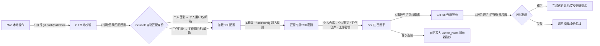
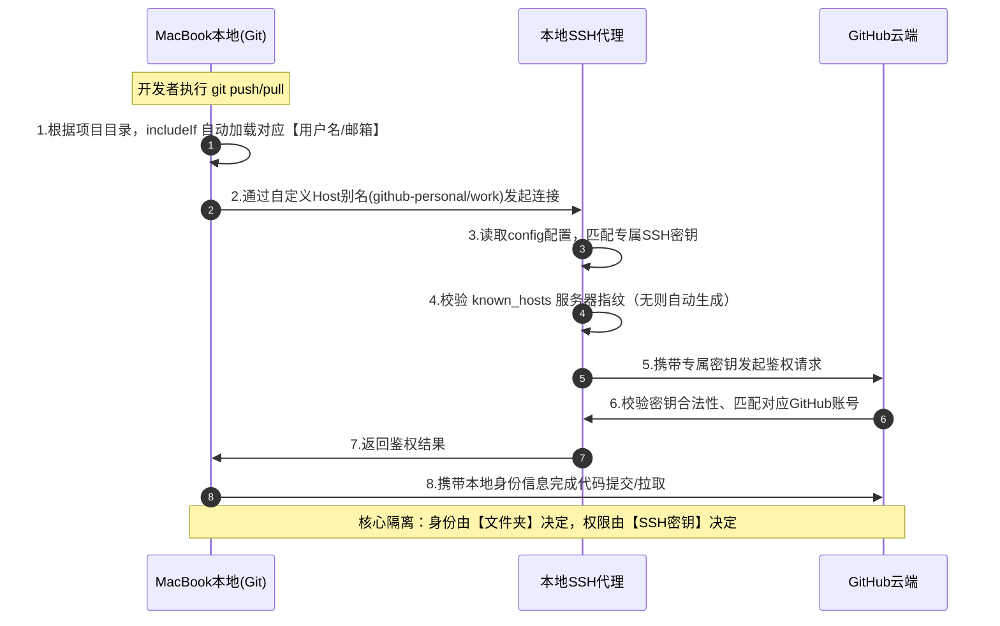

# macOS 多 GitHub 账号管理 终极实操笔记（SSH\+自动身份隔离）

## 一、核心方案原理（必看）

实现一台 Mac 多 GitHub 账号**完全无冲突**，依靠双层隔离，缺一不可：

1. **SSH 密钥隔离**：不同账号对应独立密钥，解决`push/pull 权限错乱`

2. **Git 目录身份隔离（includeIf）**：不同文件夹自动匹配对应用户名/邮箱，解决 **Commit 提交者信息错乱、贡献值不统计**

✅ 最佳组合：**独立 SSH 密钥 \+ includeIf 目录自动配置**（一次配置，永久生效）

## 二、前置统一目录规范（必须遵守）

为了让 `includeIf` 精准生效，统一本地仓库存放目录：

- 个人 GitHub 项目：`~/GitHub/personal/`

- 工作 GitHub 项目：`~/GitHub/work/`

## 三、第一步：多账号 SSH 密钥配置（远程权限隔离）

### 1\. 生成多套独立密钥（ed25519 安全算法）

```bash
# 进入ssh目录
mkdir -p ~/.ssh && cd ~/.ssh

# 1. 个人账号密钥（替换为个人邮箱）
ssh-keygen -t ed25519 -C "个人邮箱" -f ~/.ssh/id_ed25519_github_personal

# 2. 工作账号密钥（替换为工作邮箱）
ssh-keygen -t ed25519 -C "工作邮箱" -f ~/.ssh/id_ed25519_github_work
```

### 2\. 公钥分别绑定对应 GitHub 账号

```bash
# 复制个人公钥
pbcopy < ~/.ssh/id_ed25519_github_personal.pub

# 复制工作公钥
pbcopy < ~/.ssh/id_ed25519_github_work.pub
```

操作：登录对应 GitHub 账号 → Settings → SSH and GPG keys → 新增 SSH 密钥

### 3\. 核心配置：\~/\.ssh/config 分流规则

创建/编辑配置文件：`vim ~/.ssh/config`，写入以下内容

```ssh-config
# 个人账号
Host github-personal
  HostName github.com
  User git
  IdentityFile ~/.ssh/id_ed25519_github_personal
  IdentitiesOnly yes
  AddKeysToAgent yes
  UseKeychain yes

# 工作账号
Host github-work
  HostName github.com
  User git
  IdentityFile ~/.ssh/id_ed25519_github_work
  IdentitiesOnly yes
  AddKeysToAgent yes
  UseKeychain yes
```

### 4\. 修复密钥权限（必做，否则失效）

```bash
chmod 700 ~/.ssh
chmod 600 ~/.ssh/config
ca
```

### 5\. 测试连通性

```bash
ssh -T git@github-personal
ssh -T git@github-work
```

出现 `Hi 用户名! You've successfully authenticated` 即成功

## 四、第二步：Git includeIf 自动身份配置（解决 Commit 错乱）

### 1\. 重点：includeIf 你关心的 3 个核心问题（标准答案）

#### Q1：路径末尾 `/` 必须加吗？

**必须加！强制要求**

- 错误：`gitdir:~/GitHub/work` → 会模糊匹配 `workspace、work2` 等目录，身份错乱

- 正确：`gitdir:~/GitHub/work/` → 精准匹配当前目录及所有子目录

#### Q2：path 可以填仓库 repo 地址/本地仓库目录吗？

**绝对不可以**

`path` 只能指向**本地独立的 git 配置文件**，不是仓库地址、不是仓库文件夹。

#### Q3：gitdir 匹配的是什么路径？

匹配的是仓库内 `.git` 文件夹的父路径，无需手动适配子仓库，一级目录配置全局生效。

#### Q4：子文件夹多个同账号仓库，需要逐条配置吗？

**核心问题**：同一账号下，多文件夹、多仓库是否需要逐条配置 includeIf？

**1\. 单顶层目录、多子仓库**

- **结论**：无需逐条配置

- **原理**：`gitdir:xxx/` 自带**递归匹配**，单条顶层目录规则，自动适配目录内所有子文件夹、所有Git仓库

- **最佳实践**：同账号所有仓库统一归至一个顶层目录，一条配置全覆盖

**2\. 多根目录、同一账号**

- **结论**：支持多条 includeIf 规则，多个本地根目录可映射同一套账号身份

- **适用场景**：个人项目分散在多个无关文件夹，均归属同一个GitHub账号

- **标准示例**

```gitconfig
# 个人项目目录1
[includeIf "gitdir:~/projects/lalalala/"]
  path = ~/.gitconfig-personal

# 个人项目目录2
[includeIf "gitdir:~/projects/github/"]
  path = ~/.gitconfig-personal
```

- 多条规则独立生效、互不冲突，全部自动复用对应身份配置

**3\. 硬性注意事项**

- **职责隔离**：includeIf 仅管控本地提交用户名/邮箱，**不负责SSH权限、远程仓库链接**

- **远端必配**：所有本地仓库需单独绑定一次对应账号的远程地址，否则推送报错：
  clone仓库（有origin）：`git remote set-url origin 别名地址`

- init新建仓库（无origin）：`git remote add origin 别名地址`

### 2\. 完整配置流程

#### ① 创建两套独立身份配置文件

```bash
# 个人身份配置
vim ~/.gitconfig-personal
# 写入：
[user]
  name = 个人GitHub用户名
  email = 个人GitHub邮箱

# 工作身份配置
vim ~/.gitconfig-work
# 写入：
[user]
  name = 工作GitHub用户名
  email = 工作GitHub邮箱
```

#### ② 编辑全局 git 主配置

编辑：`vim ~/.gitconfig`

```gitconfig
# 全局默认身份（个人账号）
[user]
  name = 个人GitHub用户名
  email = 个人GitHub邮箱

# 工作目录自动加载工作身份（末尾/必加）
[includeIf "gitdir:~/GitHub/work/"]
  path = ~/.gitconfig-work

# 个人目录自动加载个人身份（末尾/必加）
[includeIf "gitdir:~/GitHub/personal/"]
  path = ~/.gitconfig-personal
```

## 五、仓库使用规范（新旧仓库统一规则）

### 1\. 新克隆仓库（核心：替换域名别名）

将原仓库地址 `github.com` 替换为配置的 Host 别名

```bash
# 个人仓库克隆
git clone git@github-personal:用户名/仓库名.git

# 工作仓库克隆
git clone git@github-work:用户名/仓库名.git
```

### 2\. 克隆第三方/开源仓库（多账号重点修正）

**关键约束（多账号专属规则）**：由于开启了 `IdentitiesOnly yes` 密钥锁定，**禁止使用原生 SSH 克隆第三方仓库**，会报 Permission denied。

**统一规范**：第三方公开开源仓库，只使用 **HTTPS 协议** 克隆，绕过 SSH 密钥鉴权冲突。

```bash
# 正确：第三方开源仓库克隆（唯一可用方式）
git clone https://github.com/第三方用户名/开源仓库名.git
```

- 只读开源仓库无需 SSH 权限，HTTPS 零配置、无冲突

- 若需要 Fork 后开发：Fork 到自己账号后，使用自己的 SSH 别名克隆

### 3\. 已有旧仓库修改远程地址

`git remote set-url` 仅用于**已存在 origin 远程**的仓库（clone 下来的仓库自带），仅修改本地远程地址，不校验云端仓库

```bash
# 进入仓库目录后执行
# 个人仓库
git remote set-url origin git@github-personal:个人用户名/仓库名.git

# 工作仓库
git remote set-url origin git@github-work:工作用户名/仓库名.git
```

### 4\. 本地新建仓库 \& 完整远端推送流程

本地通过 `git init` 全新创建的仓库，无默认 `origin` 远程，无法使用 `set-url`，需通过 `git remote add origin` 首次绑定远端地址，附带完整 **提交\+推送** 全流程，适配多账号别名规则：

```bash
# 1. 初始化本地仓库（仅首次执行）
git init

# 2. 绑定对应账号远端仓库（个人/工作二选一）
# 个人新建仓库绑定
git remote add origin git@github-personal:个人用户名/仓库名.git

# 工作新建仓库绑定
git remote add origin git@github-work:工作用户名/仓库名.git

# 3. 本地添加文件、提交
git add .
git commit -m "first commit"

# 4. 推送到远端主分支（新版 GitHub 默认分支为 main）
git push -u origin main
```

**关键说明**：`git push -u origin main` 中 `-u` 作用是**关联本地分支与远端分支**，首次推送必加，后续推送直接执行 `git push` 即可；所有操作自动匹配当前目录对应的 GitHub 账号身份。

## 六、高频坑点排查清单

- **提交身份不对**：执行 `git config --show-origin user.name`查看配置来源，优先保证目录规范、includeIf 末尾带 `/`

- **SSH 权限拒绝**：检查密钥权限、config 中 `IdentitiesOnly yes` 是否配置、公钥是否绑定对应账号

- **第三方仓库SSH克隆报错**：多账号密钥锁定模式下，禁止原生SSH克隆公开仓库，会触发权限拒绝，务必使用 HTTPS 协议克隆第三方开源项目

- **known\_hosts 文件缺失问题（重点解答）文件本质 \& 生成原理**：`known_hosts` 不是手动创建、也不是配置生成的系统文件，是 **第一次成功 SSH 连接远程服务器后，系统自动生成** 的缓存文件，路径固定为 `~/.ssh/known_hosts`，作用是记录 GitHub 服务器指纹，规避中间人攻击。

- **文件消失的原因**：重置/清空过 `~/.ssh` 目录、重装系统、手动删除该文件、清理终端缓存，都会导致文件消失，**属于正常现象，不是配置错误**。

- **一键恢复生成方法**：重新执行账号连通性测试，首次连接输入 `yes` 即可自动生成：
`# 依次执行，出现提示输入 yes
ssh -T git@github-personal
ssh -T git@github-work
`

- **多账号专属避坑**：多 GitHub 账号共用 `github.com` 真实域名，大概率触发 **Host key 指纹冲突**，属于高频报错，可执行命令清空旧指纹缓存：`ssh-keygen -R github.com`

## 七、最终总结（核心口诀）

1. 密钥分开：一个账号一套 SSH 密钥，别名分流

2. 目录分开：个人/工作项目分文件夹存放

3. 配置带斜杠：includeIf 路径**末尾必须加 /**

4. path 指文件：只绑定本地配置文件，不绑定仓库

5. 克隆换别名：所有仓库地址用自定义 Host 别名，杜绝冲突



## 八、完整端到端时序流程图（多账号核心工作原理）

### 1\. 交互时序图



### 2\. 流程图极简说明

整个交互分为 **身份判定 → 密钥匹配 → 云端鉴权 → 数据同步** 四步，彻底解决多账号冲突：

- **步骤1（本地身份锁定）**：Git 优先识别项目所在文件夹，通过 `includeIf` 自动切换对应账号的用户名、邮箱，确保 Commit 身份正确。

- **步骤2（SSH权限锁定）**：通过自定义 Host 别名，强制调用对应账号的专属 SSH 密钥，不会出现密钥串用错乱。

- **步骤3（安全校验）**：通过 `known_hosts` 校验服务器指纹，保障连接安全，首次连接自动生成该文件。

- **步骤4（云端交互）**：GitHub 匹配密钥对应的账号权限，完成代码推拉、提交记录同步，贡献值正常统计。

## 九、Git 命令行查看文件修改记录（极简实操）

本节汇总**只查看修改文件、不看代码细节**的高频命令，适配日常开发快速校验。

### 1\. 查看当前工作区变更（最常用）

```bash
# 完整查看所有文件变更（状态分类展示）
git status

# 极简单行展示（只看文件名+状态，推荐日常使用）
git status -s
```

### 2\. 精准筛选未提交的修改文件

```bash
# 查看：已修改、未add的文件
git diff --name-only

# 查看：已add暂存、待commit的文件
git diff --cached --name-only

# 查看：所有未提交的全部变更（工作区+暂存区）
git diff HEAD --name-only
```

### 3\. 查看历史提交的修改文件

```bash
# 查看最新一次commit修改的文件
git show --name-only

# 查看指定commit-id对应的修改文件
git diff-tree -r --name-only 目标commitID

# 对比两个提交之间修改的所有文件
git diff 旧commitID..新commitID --name-only
```

### 4\. 常用组合技巧

- 快速筛查指定文件变更：`git diff HEAD --name-only | grep 文件名`

- 提交前校验待推送文件：`git diff --cached --name-only`

> （注：部分内容可能由 AI 生成）
